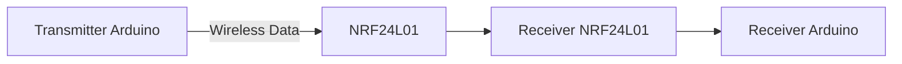

# 📡 Arduino-Based NRF Wireless Communication

<p align="center">
  
</p>

<p align="center">
  <b>📶 Wireless Data Communication using NRF24L01 Modules</b><br>
  <i>IoT | Embedded Systems | Arduino</i>
</p>

<p align="center">
  
  
  
</p>

---

## 🧠 Project Overview

This project demonstrates **wireless communication between two Arduino boards** using **NRF24L01 modules**.

* 📤 Transmitter sends data
* 📥 Receiver receives data
* 📡 Communication over 2.4 GHz

---

## ✨ Features

✔️ Long-range wireless communication 📡
✔️ Low power consumption ⚡
✔️ Real-time data transmission
✔️ Reliable & scalable system

---

## 🛠️ Components Required

| Component       | Quantity  |
| --------------- | --------- |
| Arduino Uno     | 2         |
| NRF24L01 Module | 2         |
| Jumper Wires    | As needed |
| Power Supply    | 3.3V      |

---

## 🔌 Pin Configuration (NRF24L01 → Arduino)

| NRF Pin | Arduino |
| ------- | ------- |
| VCC     | 3.3V ⚠️ |
| GND     | GND     |
| CE      | D9      |
| CSN     | D10     |
| SCK     | D13     |
| MOSI    | D11     |
| MISO    | D12     |

---

## 🏗️ Working Principle



---

## 📸 Project Preview

### 🔧 Hardware Setup

<p align="center">
  
</p>

### ⚙️ Circuit Diagram

<p align="center">
  
</p>

---

## 🧾 Code Structure

* 📤 `transmitter/transmitter.ino` → Sends data
* 📥 `receiver/receiver.ino` → Receives data

---

## 🚀 How to Run

```bash
1. Connect NRF modules to both Arduinos
2. Upload transmitter code to first Arduino
3. Upload receiver code to second Arduino
4. Open Serial Monitor
5. Observe transmitted data
```

---

## 📊 Output

📤 Transmitter sends:

```
Hello World
```

📥 Receiver receives:

```
Data Received: Hello World
```

---

## ⚠️ Challenges Faced

* NRF requires stable **3.3V supply** ⚡
* Connection issues due to loose wiring
* Signal interference 📡

---

## 🔮 Future Scope

🚀 IoT-based wireless sensor network
🤖 Smart home automation
📱 Mobile-controlled systems
🌐 Cloud integration

---

## 👨‍💻 Author

**Rakesh M H**

---

## ⭐ Support

If you like this project → ⭐ Star this repository!
