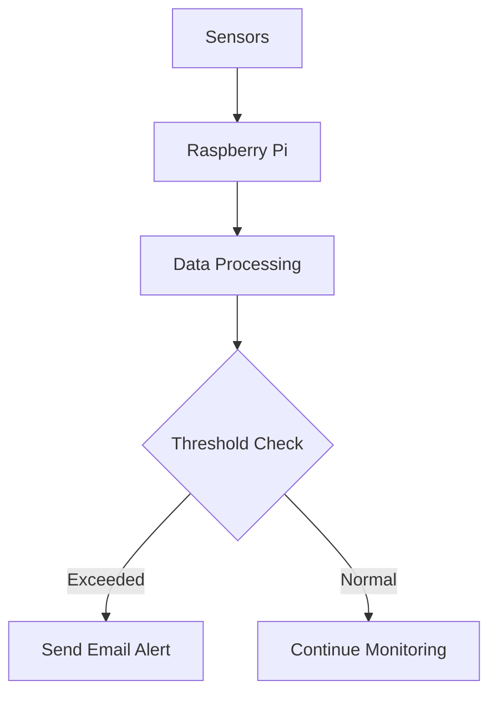

# 🌱 Smart Plant Monitoring System using Raspberry Pi

<p align="center">
  <b>🌿 Monitor Plant Health with IoT & Instant Email Alerts 📧</b><br>
  <i>Raspberry Pi | Python | IoT</i>
</p>

<p align="center">
  
  
  
</p>

---

## 🧠 Project Overview

This project is an **IoT-based Smart Plant Monitoring System** that continuously tracks environmental conditions and sends **instant email alerts** when values go beyond safe limits.

🌡️ Temperature
💧 Soil Moisture
🌫️ Humidity
☀️ Light Intensity

👉 Helps in **efficient plant care and smart agriculture**

---

## ✨ Features

✔️ Real-time monitoring 📊
✔️ Instant email alerts 📧
✔️ Low-cost IoT solution
✔️ Easy to expand (AI, Cloud, App)
✔️ Suitable for home & agriculture

---

## 🏗️ System Architecture



---

## 🛠️ Hardware Components

| Component            | Description            |
| -------------------- | ---------------------- |
| Raspberry Pi 2       | Main controller        |
| Soil Moisture Sensor | Detects water level    |
| DHT22 Sensor         | Temperature & humidity |
| LDR Sensor           | Light intensity        |
| Wi-Fi Module         | Internet connectivity  |

---

## 💻 Software Stack

* 🐍 Python
* 📡 SMTP (Email Alerts)
* 🔌 RPi.GPIO
* 🌡️ Adafruit_DHT

---

## ⚙️ Working Principle

1. Sensors collect environmental data
2. Raspberry Pi processes the data
3. Values compared with thresholds
4. 📧 Email alert sent if abnormal

---

## 📸 Project Preview

<p align="center">
  
</p>

<p align="center">
  
</p>

---

## 📧 Email Alert Example

```text
Subject: ⚠️ Low Soil Moisture Alert

Warning!
Soil moisture is LOW (250).
Please water your plant immediately.
```

---

## 🚀 Installation & Setup

```bash
git clone https://github.com/your-username/smart-plant-monitoring.git
cd smart-plant-monitoring
pip install -r requirements.txt
python main.py
```

---

## ⚠️ Challenges Faced

* Sensor calibration issues 🎯
* Moisture sensor corrosion
* Unstable Wi-Fi connectivity 📡
* Power management ⚡
* Email sending limits

---

## 📊 Results

✅ Real-time monitoring achieved
✅ Instant alerts working
✅ Improved plant health
✅ Reduced water wastage

---

## 🔮 Future Enhancements

🚀 Mobile app integration
🤖 AI-based prediction
☁️ Cloud storage
🌍 Weather API integration
📡 LoRa communication

---


---

## ⭐ Support

If you like this project:
👉 Give it a ⭐ on GitHub
👉 Share with others

---

<p align="center">
  🌿 Smart Plants, Smart Future 🌿
</p>
